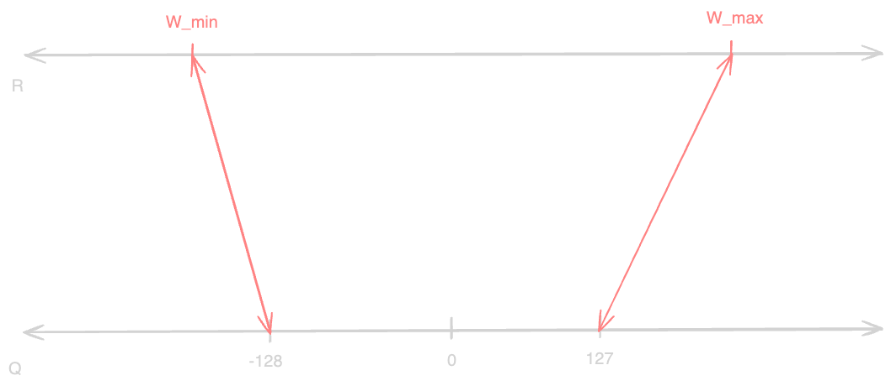
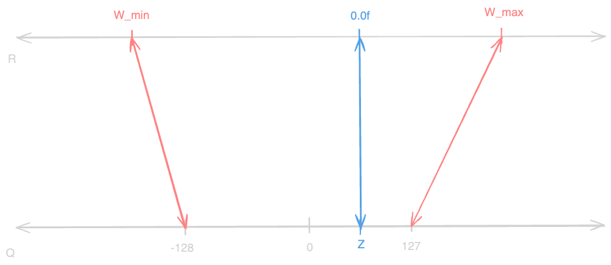
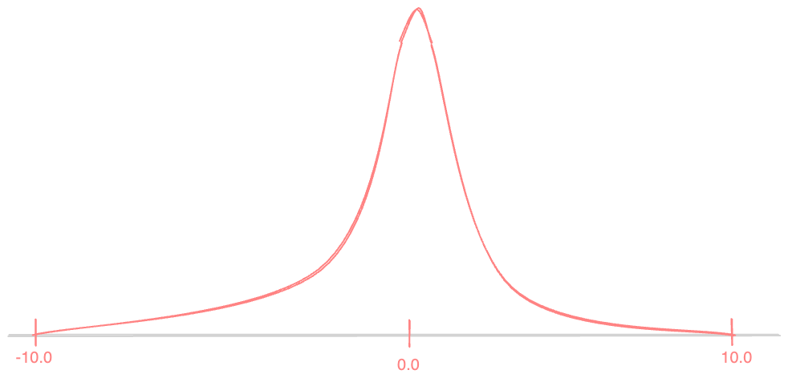

# Quatization Aware Training

In this tutorial, we will be looking at the concept of quantization aware training, how does it work in depth, its benefits and how to implement it in PyTorch. To properly understand
this concept, proper understanding of the concept of quantization is required.


## What is Quantization?

Formally, quantization is the process of constraining an input from a continuous or otherwise large set of values to a discrete set of values. You can think of it as a way to reduce the precision of the data. In neural networks, quantization is the process of reducing the precision of the weights and activations. This can be helpful in different ways.

1) **Memory Reduction:**
    In the example of current LLMs, the weights of the feed-forward layers are quite large. Imagine a forward layer weight matrix in Llama 3 70B Model, the weight matrix could be of size
    `8192 * 8192`. In case of 16-bit precision, this weight matrix would require `8192 * 8192 * 2 = 131072` bytes of memory. This is a lot of memory to store and process. In case we reduced
    the precision of the weights, we can reduce the load times from memory approximately two, four-fold respectively when using int8 and int4 data types.

2) **Speedup:**
    Quantization can also help in speeding up the inference, sometimes even the training process. From computer architecture perspective, the operations on large data types, such as
    `float16` or `float32`are expensive and slow. These operations are way faster and cheaper when performed on smaller data types like `int8` or `float8`. When we take a look at the current state-of-the-art GPU Nvidia H100 and its [datasheet](https://resources.nvidia.com/en-us-tensor-core/nvidia-tensor-core-gpu-datasheet), we can see that the performance of the GPU Tensor Cores linearly increases with the decrease in the data type size.


Now, that we have a basic understanding on why quantization is important, let's take a look at how quantization works. 

***Important*** To simplify things, we will only be looking at quantization to a lower precision data type, that exists in the PyTorch framework, to avoid hassles of binary operations. That is going from `torch.float16` to `torch.int8`, also we will be considering a method called `Linear Quantization`.

### How does Quantization work?
If we think of `int8` as a data type, it can store values in the range of `[-128, 127]`. However, our weights and activations in `float16` have a range of `[-65504, 65504]`. Also, this range in `float16` is not uniformly distributed, therefore accommodating a lot more possible values. To quantize the weights and activations, we need to map the values in `float16` to the range of `int8`. This can be done by the following steps:

1) **Min and Max Calculation:**
    We need to calculate the minimum and maximum values in the data. This will tell us what values map to `int8.min` and `int8.max`.

    
    *Figure 1: Visual representation of min and max calculation, `W_max` and `W_min` are the maximum and minimum values in tensor to be quantized, these values then map to `int8.max` and `int8.min` respectively.*


2) **Zero Point Calculation:**
    We can think of zero point as the point where the `float16` value of `0` lies in the `int8` data type. This basically maps the real number `r=0` to a quantized integer.


    
    *Figure 2: Visual representation of zero point calculation. `Z` on the quantized axis is the zero point, and represents where the `r=0.0` lies on the quantized axis.*

3) **Scale Calculation:**
    The scale is basically tells us how much each unit in the quantized data type represents. Imagine a scale of `1.0`, this means that each unit in the quantized data type represents `1.0` in the original data type.


After these steps, we have everything we need to quantize and dequantize the data. With `r` being the real number, `q` being the quantized number, `Z` being the zero point, and `S` being the scale, the quantization and dequantization can be done by the following equations:

$$
q = \text{round}\left(\frac{r}{S}\right) + Z
$$
$$
r = (q - Z) \cdot S
$$

With some additional math, we can also derive the scale and zero point equations from the min and max values.

$$
S = \frac{W_{max} - W_{min}}{Q_{max} - Q_{min}} = \frac{W_{max} - W_{min}}{127 - (-128)}
$$
$$
Z = \text{round}\left(Q_{min} - \frac{W_{min}}{S}\right) = \text{round}\left(-128 - \frac{W_{min}}{S}\right)
$$

## Pytorch Implementation

```python
import torch
from collections import namedtuple

QTensor = namedtuple(
    "QTensor", ["tensor", "scale", "zero_point"]
)  # we need to track the scale and zero point to dequantize the tensor later


def quantize_tensor(tensor: torch.Tensor) -> QTensor:
    W_min = tensor.min()
    W_max = tensor.max()

    Q_min = torch.iinfo(torch.int8).min  # Get the minimum value of the int8 data type
    Q_max = torch.iinfo(torch.int8).max  # Get the maximum value of the int8 data type

    S = (W_max - W_min) / (Q_max - Q_min)  # Calculate the scale
    Z = torch.round(Q_min - (W_min / S))  # Calculate the zero point

    quantized_tensor = torch.round(tensor / S) + Z  # Quantize the tensor

    return QTensor(
        tensor=quantized_tensor.to(torch.int8), scale=S, zero_point=Z
    )  # Return the quantized tensor, scale, and zero point


def dequantize_tensor(q_tensor: QTensor) -> torch.Tensor:
    return (
        q_tensor.tensor.to(torch.float16) - q_tensor.zero_point
    ) * q_tensor.scale  # simply compute the real value from the already computed data
```

### Clipping
You might have noticed, we lose quite a lot of information while quantizing the tensor. This might lead to a precision loss, which can be detrimental to the performance of the model. Imagine a scenario where our input tensor distribution looks like the following:


*Figure 3: A pretty common distribution of weights, where most of the values are centered around 0.0.*

Now imagine, we have a single data-point, which is far from the distribution, let's say `W_max=1000.0`. If we try to quantize this tensor, the scale would be very large, therefore a distance of `1` in the quantized data would represent a very large distance in the original unquantized data.
But remember, our input tensor is distributed around `0.0`, with most values lying in the range of `[-10.0, 10.0]`. This means that most of these values would be quantized to the same value, therefore losing a lot of information leading to a loss in performance.

To fix this issue, we can use a method called `Clipping`. This method involves clipping the values of the tensor to a certain range, and then quantizing the tensor. Our PyTorch implementation can be extended to include this method by the following:

```python
def quantize_tensor(
    tensor: torch.Tensor, clip_min: float | None = None, clip_max: float | None = None
) -> QTensor:
    if clip_min or clip_max: # check if atleast one of the clip values is provided
        tensor = torch.clip(tensor, clip_min, clip_max)

    W_min = tensor.min()
    W_max = tensor.max()

    Q_min = torch.iinfo(torch.int8).min  # Get the minimum value of the int8 data type
    Q_max = torch.iinfo(torch.int8).max  # Get the maximum value of the int8 data type

    S = (W_max - W_min) / (Q_max - Q_min)  # Calculate the scale
    Z = torch.round(Q_min - (W_min / S))  # Calculate the zero point

    quantized_tensor = torch.round(tensor / S) + Z  # Quantize the tensor

    return QTensor(
        tensor=quantized_tensor.to(torch.int8), scale=S, zero_point=Z
    )  # Return the quantized tensor, scale, and zero point
```
This is the only required change to the implementation.

### Quantization Granularity

Another method to improve the performance of the quantized model is called `Quantization Granularity`. With the above implementation, we are computing the scale and zero point for the entire tensor. We could improve on this, by computing these values for a sub-part of the tensor. There are different variants of tensor splitting, such as `Per Channel`, `Per Token`, etc. The only difference between these variants is across which dimension is the zero point and scale computed. This can further lead to a better performance of the model, with cost of only a few extra bytes stored in memory. To save time and space, we will not be implementing these methods from scratch here, but just have this in mind when existing quantization schemes are shown.

## Quantization Aware Training 

Quantization Aware Training is a method to furhter improve the performance of the quantized model. This method involves making the model *used to* quantized weights, activations respectively. 


